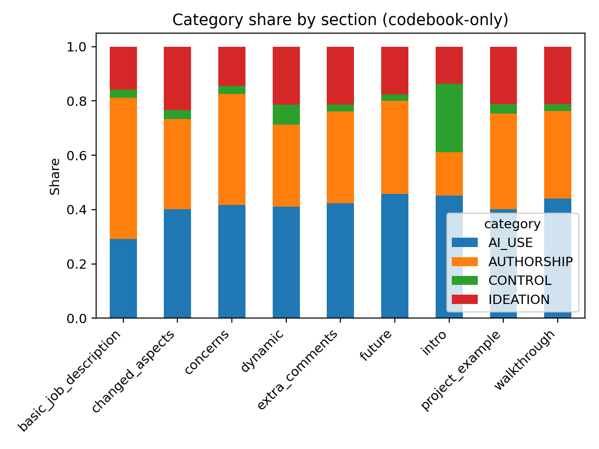
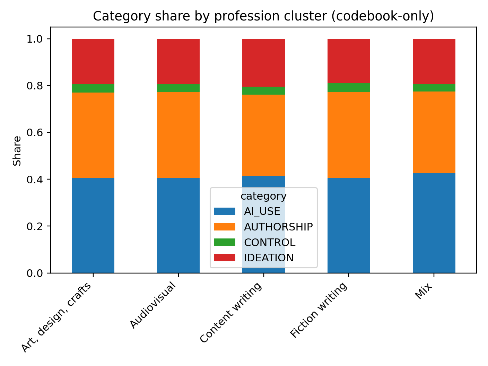
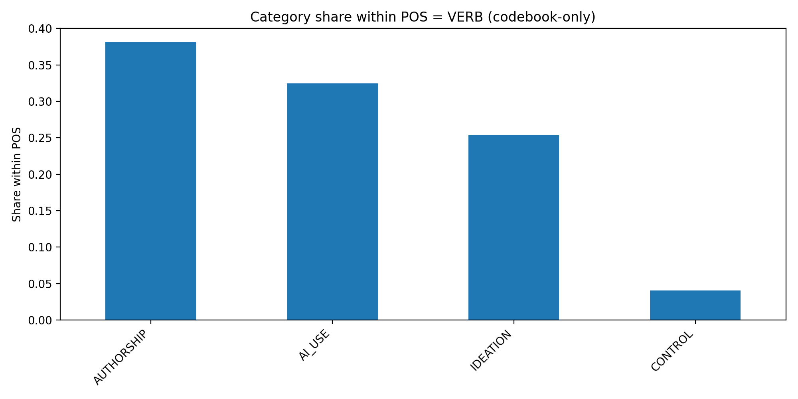
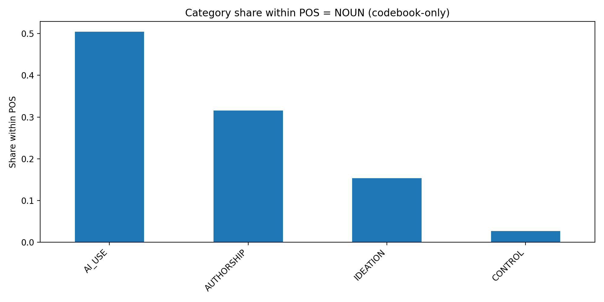
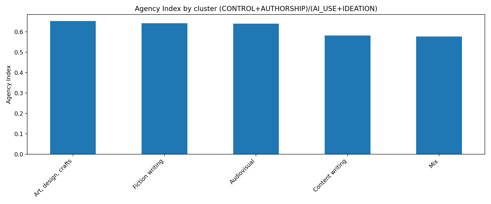

# Categorized Lexis Report (codebook-only)

This report summarizes counts and shares **restricted to the annotated codebook lemmas only**.

Categories: **AI_USE, CONTROL, AUTHORSHIP, IDEATION**.

## Overview

### Category totals (token counts)

| category   |   token_count |
|:-----------|--------------:|
| AI_USE     |         14606 |
| AUTHORSHIP |         12625 |
| IDEATION   |          7473 |
| CONTROL    |          1222 |

### Agency Index by cluster

Agency Index = (CONTROL + AUTHORSHIP) / (AI_USE + IDEATION)

| group               |   agency_index |
|:--------------------|---------------:|
| Art, design, crafts |       0.653133 |
| Fiction writing     |       0.642182 |
| Audiovisual         |       0.640747 |
| Content writing     |       0.582532 |
| Mix                 |       0.577631 |

## Figures

### Category share by section

### Category share by cluster

### Category share within VERB

### Category share within NOUN

### Agency Index by cluster

## Top lemmas per category

### AI_USE

**NOUN (top 15)**

| lemma     |   count |
|:----------|--------:|
| ai        |    1531 |
| help      |     401 |
| creative  |     395 |
| time      |     352 |
| model     |     218 |
| need      |     218 |
| one       |     208 |
| process   |     204 |
| tool      |     194 |
| lot       |     188 |
| way       |     176 |
| research  |     157 |
| character |     147 |
| example   |     136 |
| change    |     125 |

**VERB (top 15)**

| lemma    |   count |
|:---------|--------:|
| use      |    1019 |
| do       |     952 |
| help     |     401 |
| feel     |     275 |
| want     |     249 |
| ask      |     243 |
| take     |     241 |
| see      |     226 |
| generate |     186 |
| know     |     151 |
| sound    |     149 |
| say      |     146 |
| provide  |      92 |
| become   |      88 |
| point    |      82 |

### AUTHORSHIP

**NOUN (top 15)**

| lemma   |   count |
|:--------|--------:|
| work    |     569 |
| image   |     264 |
| thing   |     264 |
| project |     250 |
| person  |     244 |
| writing |     237 |
| design  |     177 |
| human   |     154 |
| story   |     141 |
| art     |     134 |
| video   |     134 |
| content |     128 |
| book    |     126 |
| part    |      92 |
| novel   |      79 |

**VERB (top 15)**

| lemma   |   count |
|:--------|--------:|
| be      |    3934 |
| work    |     569 |
| create  |     310 |
| write   |     310 |
| go      |     218 |
| need    |     218 |
| design  |     177 |
| change  |     125 |
| edit    |     103 |
| put     |      71 |
| include |      64 |
| draft   |      62 |
| read    |      61 |
| produce |      60 |
| add     |      57 |

### CONTROL

**NOUN (top 15)**

| lemma      |   count |
|:-----------|--------:|
| question   |     112 |
| decision   |      80 |
| media      |      65 |
| flow       |      42 |
| control    |      37 |
| direction  |      37 |
| experience |      35 |
| chat       |      26 |

**VERB (top 15)**

| lemma     |   count |
|:----------|--------:|
| make      |     403 |
| let       |      73 |
| drive     |      58 |
| set       |      50 |
| allow     |      49 |
| lead      |      30 |
| decide    |      29 |
| choose    |      20 |
| guide     |      20 |
| pick      |      17 |
| direct    |      15 |
| manage    |      13 |
| determine |      11 |

### IDEATION

**NOUN (top 15)**

| lemma       |   count |
|:------------|--------:|
| use         |    1019 |
| idea        |     440 |
| sound       |     149 |
| editing     |      91 |
| etc.        |      86 |
| style       |      81 |
| concept     |      59 |
| creativity  |      50 |
| outline     |      49 |
| inspiration |      45 |
| area        |      44 |
| theme       |      42 |
| sort        |      38 |
| term        |      35 |
| blog        |      34 |

**VERB (top 15)**

| lemma      |   count |
|:-----------|--------:|
| have       |    1431 |
| like       |     518 |
| think      |     394 |
| get        |     360 |
| give       |     216 |
| come       |     211 |
| find       |     208 |
| look       |     167 |
| research   |     157 |
| start      |     137 |
| try        |     129 |
| tell       |      93 |
| keep       |      79 |
| base       |      64 |
| brainstorm |      50 |

## Data files

- category_by_section.csv

- category_by_cluster.csv

- pos_by_category.csv

- top_lemmas_by_category.csv

- top_lemmas_by_category_by_cluster.csv

- top_lemmas_by_category_by_section.csv
